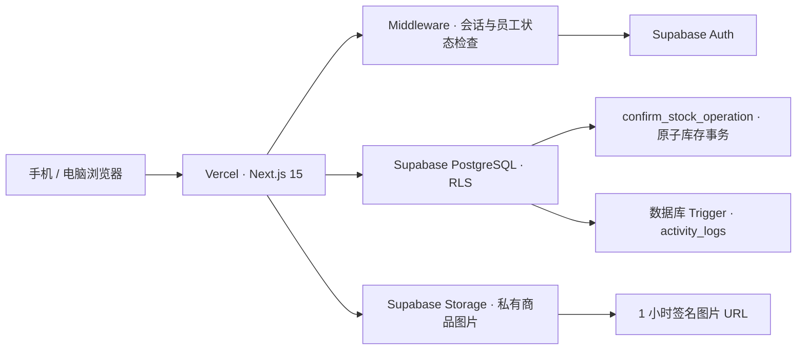

# 系统架构

## 总览

浏览器访问 Vercel 上的 Next.js 应用。Supabase Auth 负责密码和会话；`staff` 表负责业务显示名、启用状态和日志身份。应用不会保存明文密码。

## 主要模块

| 模块 | 位置 | 职责 |
| --- | --- | --- |
| 页面 | `app/` | 登录、库存、新产品、日志和操作页面 |
| 交互组件 | `components/` | 库存卡片、库存草稿、操作单日志、图片上传、会话信息 |
| 业务读取 | `lib/` | 商品目录、库存、操作单日志查询和业务规则 |
| Supabase 连接 | `lib/supabase/` | 浏览器/服务器客户端、配置、Middleware |
| 数据库版本 | `supabase/migrations/` | 表、索引、RLS、Trigger、RPC 和 Storage 策略 |
| 数据导入 | `scripts/product-import/` | Excel 检查和已审核 Best Seller 导入 |
| 自动测试 | `tests/` | 箱规、库存差异、商品筛选、批量交互和操作单日志 |

## 关键流程

### 登录

1. 登录页显示员工姓名，但内部使用该员工的 Supabase Auth 邮箱登录。
2. Middleware 调用 `is_active_staff()`；只有已登录且 `staff.is_active = true` 的账号能进入系统。
3. 所有启用员工目前拥有相同操作权限。

### 查看商品

1. Server Component 从 `products`、`ips`、`inventory_balances` 读取目录。
2. 私有 `product-images` bucket 不公开；服务器为图片生成短期签名 URL。
3. 前端默认过滤三种库存均为 0 的商品；有货/全部/无货筛选可与搜索组合，不写入数据库。
4. 库存折合数为 `箱 × 每箱总数 + 端 × 每端盒数 + 散盒`，仅用于显示和排序；数据库仍分别保存三个物理数量。

### 调整库存

1. 用户在多个商品卡片上编辑箱、端、盒差异，浏览器先保存为未提交草稿。
2. 提交前显示完整汇总和调整后结果。
3. `confirm_stock_operation` RPC 在一个数据库事务中锁定余额、校验全部项目、拒绝负库存、写入操作单和前后快照，然后更新余额。
4. 数据库 Trigger 将操作人、时间和 before/after 数据写入 `activity_logs`。

### 查看库存日志

1. `/logs` 直接从 `stock_operations` 分页，因此分页单位始终是一张操作单。
2. 每张操作单通过主键 `stock_operations.id = stock_operation_items.operation_id` 读取商品明细，不按人员或时间推测合并。
3. 首页只显示操作单摘要；商品图片、SKU 和 before/delta/after 快照在用户展开时显示。
4. `activity_logs` 仍完整保存各业务表的底层审计记录，但普通日志页面不会把操作单头和商品行平级重复展示。

### 新增商品

手机选择图片后，浏览器将长边压缩至最多 1600px，再上传私有 Storage；随后创建商品和主图记录。新商品初始库存为 0，库存必须通过正式库存操作增加。

### 编辑商品

商品卡片进入独立编辑页，资料修改与库存调整互不混用。保存前强制校验 `中盒件数 × 每箱中盒 = 原表 Quantity/Carton`；已有库存商品修改箱规时会再次确认。替换图片时先上传新文件并更新图片记录，保存失败会尽量恢复原图片。

## 安全边界

- Publishable Key 可以出现在浏览器中，但所有数据访问仍受 RLS 和员工状态控制。
- Secret/Service Role Key 只能用于受控的本地管理任务，绝不能进入浏览器或 GitHub。
- 库存写入优先通过数据库 RPC，而不是由浏览器分别更新多张表。
- 图片 bucket 为私有；数据库只保存 Storage path，不保存公开永久地址。
- 数据变更日志由数据库 Trigger 生成，前端无法选择跳过。

## 当前限制

- 当前业务界面只使用第一个启用仓库 `Montery Park`；多仓切换尚未实现。
- 登录姓名与 Auth 邮箱的映射目前位于 `components/login-form.tsx`，新增员工时需同时更新代码。
- 库存调拨和定期备份自动化仍属于后续功能。
