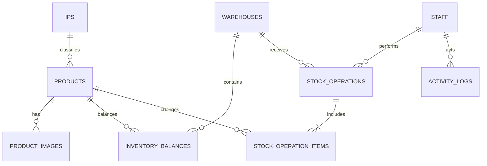

# 数据库结构

Supabase PostgreSQL 的完整结构以 `supabase/migrations/` 为唯一版本来源。Dashboard 中的手动改动也应补成新迁移，避免生产数据库与 Git 历史不一致。

## 核心关系

## 目录与图片

- `products`：SKU、中英文名、IP、类型、尺寸、价格、箱规、原表 Details 和目录状态。`product_name_zh` 是主要展示名。
- `ips`：IP 的英文标准名、中文显示名和排序。
- `brands`：品牌预留表。
- `product_images`：私有 Storage path、主图标记和排序；真实文件位于 `product-images` bucket。

箱规字段：

- `units_per_inner`：每端/中盒有多少盒；
- `inners_per_carton`：每箱有多少端/中盒；
- `units_per_carton`：数据库生成值，等于前两项相乘；
- `quantity_per_carton_source`：原 Excel 的 Quantity Per Carton，用于人工核对；
- `details_raw`：原 Excel Details 原文；
- `size_text`、`image_source`：原始尺寸与图片来源说明。

## 仓库与库存

- `warehouses`：仓库；当前启用 `Montery Park`。
- `inventory_balances`：每个 `(warehouse_id, product_id)` 唯一一行，分别保存 `carton_qty`、`inner_qty`、`unit_qty`，不自动拆箱或进位。
- `stock_operations`：一次确认操作的单头，包含操作编号、类型、人员、仓库、备注和确认时间。
- `stock_operation_items`：每个商品的箱/端/盒差异以及 before/after 快照。

普通日志页面以 `stock_operations.id` 为唯一分组和分页单位。每张操作单的商品明细只通过 `stock_operation_items.operation_id` 读取；不会按照员工姓名或提交时间合并，因此同一员工连续提交的两张操作单仍然是两条独立记录。

`confirm_stock_operation` 是库存写入入口。RPC 在同一个事务中锁定并验证所有相关余额，任一行失败时整体回滚。

## 员工与审计

- `auth.users`：Supabase 管理的登录邮箱、密码哈希和会话，应用不直接读取密码。
- `staff`：通过 `auth_user_id` 关联 Auth 用户，保存显示名、启用状态和业务身份。
- `activity_logs`：数据库 Trigger 自动写入操作人、动作、表名、实体 ID、before/after JSON 和时间。

`activity_logs` 是完整底层审计轨迹，可能同时包含操作单头、商品行和余额表的记录。普通员工看到的库存日志不会直接平铺这些 Trigger 行，而是从 `stock_operations` 和 `stock_operation_items` 生成一张操作单摘要及其可展开明细。

`staff_sessions` 和 `product_audit_logs` 是早期设计保留表；当前登录使用 Supabase Auth，会话摘要读取 Auth 会话，统一审计使用 `activity_logs`。

## 导入追踪

- `import_batches`：一次文件导入的来源、状态和汇总。
- `import_batch_items`：源行、规范化数据、验证状态和最终商品关联。

## RLS 权限

业务表均启用 Row Level Security。`is_active_staff()` 验证当前 Auth 用户是否关联启用员工；所有启用员工目前拥有相同读写权限。`activity_logs` 只允许读取，写入由数据库 Trigger 完成。
